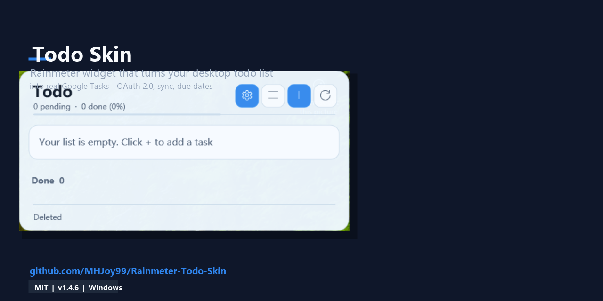
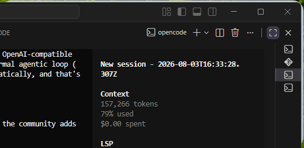

<!--
Meta description: Todo Board is a Rainmeter todo skin that turns your desktop into a todo widget with a daily arXiv paper feed, DeepSeek scoring, file-server sync, title translation and optional Google Tasks sync. v1.5.0 adds one-click Google Tasks sign-in with a built-in OAuth client, DPAPI-encrypted tokens, an all-English UI, DPI-aware scaling and a self-updater. Todos live in a local tasks.json file and stay fully offline-capable.

Keywords: Rainmeter todo skin, Google Tasks Rainmeter widget, desktop todo board, sync Google Tasks to desktop, Windows todo widget, all-day Google Task, Rainmeter Google Tasks OAuth, arXiv paper feed, DeepSeek paper scoring, TodoHost, MHJoy99
-->

# Rainmeter Todo Skin — Google Tasks Desktop Widget





## TL;DR / What is this?

Todo Board is a Windows Rainmeter skin that puts a todo board widget directly on your desktop. It is fully local-first — every todo lives in a local `tasks.json` file, so the board keeps working offline. You can optionally connect it to Google Tasks: after a one-time sign-in (Settings → Google Tasks → "Sign in with Google"), clicking a todo that has no custom link creates a real Google Task in your account via OAuth 2.0; a todo with a date becomes an all-day Google Task that shows up in the Calendar Tasks layer and at tasks.google.com. The skin also pulls a daily arXiv paper feed, scores papers with DeepSeek, syncs results through a file server, and can translate paper titles via Tencent Cloud.

## Table of Contents

- [New in v1.5.0](#new-in-v150)
- [Features](#features)
- [Requirements](#requirements)
- [Installation](#installation)
- [Google Account Setup](#google-account-setup)
- [Optional Setup](#optional-setup)
- [Frequently Asked Questions](#frequently-asked-questions)
- [Building from Source](#building-from-source)
- [Privacy](#privacy)
- [Documentation](#documentation)
- [License](#license)

## Status

- License: MIT
- Latest version: 1.5.0
- Maintainer: MHJoy99
- Platform: Windows 10 / Windows 11

## New in v1.5.0

- **One-click Google Tasks sign-in.** The host app ships with a built-in OAuth 2.0 client (client ID and secret compiled into TodoHost.exe), so no Google Cloud project is needed. Open Settings → **Google Tasks** → **Sign in with Google**, approve in your browser (loopback redirect at `http://127.0.0.1:8392/`), and you are done. "Sign out" removes the saved account. Advanced users can still bring their own client by placing a `gtasks-client.json` (desktop or web OAuth client JSON) in `@Resources`.
- **DPAPI-encrypted tokens.** OAuth tokens are stored encrypted with Windows DPAPI (current user) in `@Resources\gtasks.secret`; existing plaintext token files are migrated automatically on first use. Tokens refresh automatically, and revoked grants are detected and cleaned up.
- **UTF-8 file handling.** The generated Rainmeter settings (`Generated.inc`) are written as UTF-8 without a byte-order mark, and only rewritten when the content actually changes.
- **All-English UI.** The settings dialog ("Todo settings" with Papers / Google Tasks / DeepSeek API / Filter & Score / File Sync / Translation / About tabs), the task editor ("New task" / "Edit task") and the task manager ("All tasks") are fully English.
- **DPI-aware layout.** The host is process-DPI aware and auto-scales the tile and dialogs; windows additionally compensate for displays above the 120-DPI design baseline, fixing layout issues on 100% DPI screens and high-DPI displays alike. The UI scale (auto or 50%–200%) can be set on the About tab.
- **Updated updater.** "Check for updates" (About tab) now checks the `MHJoy99/Rainmeter-Todo-Skin` GitHub releases for the newest version tag and downloads the `Todo-Skin-v<version>.zip` package, installing both the Todo and Calendar skins while preserving user data (`tasks.json`, `ui-scale.txt`, secrets).
- **Assembly metadata.** The host executables carry product/company/version metadata ("Rainmeter Todo Skin" by MHJoy99, version 1.5.0.0), and the About tab shows the runtime version read from `app-version.txt`.

## Features

| Feature | Description |
| --- | --- |
| Task list widget | Add, edit, delete and toggle (complete/uncomplete) todos directly on the desktop widget |
| Local-first storage | All todos are stored locally in `@Resources\tasks.json`; nothing is stored in the cloud except tasks you intentionally create |
| Click-to-create Google Task | Clicking a todo without a custom link creates a real task in Google Tasks through the Google Tasks API |
| All-day tasks from dates | A todo with a date (YYYY-MM-DD) syncs as an all-day task (`YYYY-MM-DDT00:00:00.000Z`) |
| Dated vs. undated | Todos without a date are created as tasks without a due date |
| One-click Google sign-in | Built-in OAuth client, DPAPI-encrypted tokens, auto refresh; no Google Cloud setup required |
| Custom links preserved | Todos with custom links open the link normally and are never sent to Google |
| Daily paper feed | Pulls a daily arXiv paper feed (configurable import count and cache retention) |
| DeepSeek scoring | Optional DeepSeek (OpenAI-compatible) scoring of titles and abstracts, with configurable prompts, thresholds and concurrency |
| File server sync | Shares scoring results with your other devices through a File Browser account |
| Title translation | Optional Tencent Cloud (TMT) translation of paper titles; credentials are DPAPI-encrypted |
| Offline capable | The todo board works completely offline; Google is only contacted when you click a todo without a custom link |
| C# host app | TodoHost.exe, a lightweight C# host that handles OAuth, the Google Tasks API, paper scoring and local storage |
| Self-updating | Built-in updater checks GitHub releases and installs new versions, restarting Rainmeter |

## Requirements

- Windows 10 or Windows 11
- Rainmeter 4.5.26 or newer
- A Google account (only for the optional Google Tasks sync feature)
- .NET Framework 4.x runtime (ships with Windows; used by the included TodoHost.exe)
- Internet connection only needed for Google Tasks, the paper feed, DeepSeek scoring, file sync and translation

## Installation

1. Download the latest release (version 1.5.0) of the Todo Board skin from the [Releases page](https://github.com/MHJoy99/Rainmeter-Todo-Skin/releases).
2. Install it either way:
   - **rmskin**: double-click `Todo-Skin-v1.5.0.rmskin` and let the Rainmeter installer handle everything (it installs the Todo and Calendar skins).
   - **zip**: extract `Todo-Skin-v1.5.0.zip` and copy the `Skins\Todo` folder (and `Skins\Calendar` for the companion calendar) into your Rainmeter skins directory, e.g. `Documents\Rainmeter\Skins`.
3. Open Rainmeter, click "Refresh All" in the Rainmeter context menu (or restart Rainmeter) so the new skin appears.
4. Load the "Todo Board" skin from the Rainmeter skin list. The widget now runs fully offline with its local `tasks.json`.
5. Optional: connect Google Tasks — see [Google Account Setup](#google-account-setup).

## Google Account Setup

v1.5.0 no longer requires creating your own Google Cloud project:

1. Open the skin's Settings window → **Google Tasks** tab.
2. Click **Sign in with Google**. Your default browser opens the Google consent page (scope: `https://www.googleapis.com/auth/tasks`).
3. Approve the request. The browser is redirected to `http://127.0.0.1:8392/` and the host stores the tokens.
4. Your token is stored encrypted with Windows DPAPI at `@Resources\gtasks.secret` and is refreshed automatically. Click **Sign out** on the same tab to remove the saved account.

You can replace the built-in OAuth client with your own by placing a `gtasks-client.json` file (an "installed"/"web" OAuth client JSON from [Google Cloud Console](https://console.cloud.google.com/apis/credentials)) in `@Resources` — it takes precedence over the built-in client. See [docs/GOOGLE_TASKS_SETUP.md](docs/GOOGLE_TASKS_SETUP.md) for how to create your own client, and [docs/CONFIGURATION.md](docs/CONFIGURATION.md) for the file layout.

## Optional Setup

- **DeepSeek scoring** — Settings → **DeepSeek API**: enter your Chat Completions URL, model and API key, then tune prompts and thresholds on **Filter & Score**. DeepSeek is only called after a manual refresh with confirmation, never automatically.
- **Paper feed** — Settings → **Papers**: "Papers to import per day" (1–20) and "Cache retention days" (1–90); "Re-fetch and score" re-runs the current filters against fresh papers.
- **File server sync** — Settings → **File Sync**: enable file server sync and enter your File Browser URL, account and password so scoring results can be shared between devices.
- **Title translation** — Settings → **Translation**: enter your Tencent Cloud SecretId/SecretKey to translate paper titles to Chinese; credentials are DPAPI-encrypted.
- **CalDAV calendar** — the companion Calendar skin (installed by the same package) can sync with any CalDAV server; its credentials are stored DPAPI-encrypted in `caldav.secret`.

## Frequently Asked Questions

### Does this create Google Calendar events?

No. This skin creates real Google Tasks, not Google Calendar events. Tasks with a date are created as all-day tasks (sent to the Google Tasks API with a due date of `YYYY-MM-DDT00:00:00.000Z`), which then appear in the Google Calendar Tasks layer and at tasks.google.com.

### Do I need my own Google Cloud project?

No. The host app ships with a built-in OAuth client, so one-click sign-in works out of the box. Bringing your own client is optional (see [Google Account Setup](#google-account-setup)).

### Where do my tasks appear?

All tasks you create appear at tasks.google.com and in the Tasks layer of Google Calendar. On the desktop, everything is shown on your Todo Board widget.

### Is my token safe?

Yes. Tokens are encrypted with Windows DPAPI under your Windows user account and stored locally in `@Resources\gtasks.secret`; nothing is uploaded anywhere. The built-in OAuth client secret is compiled into the host app and never sent outside the OAuth flow.

### Can I use it without Google?

Yes. Todo Board is local-first: every todo lives in the local `tasks.json` file, and all add, edit, delete and toggle operations work completely offline. Google is only contacted when you click a todo without a custom link to create a task.

### What happens when I click a todo?

If the todo has a custom link, the link opens normally in your browser. If it has no custom link, TodoHost.exe calls the Google Tasks API and creates a real Google Task — all-day if a date is set, without a due date otherwise.

### Why is a C# host app needed?

The TodoHost.exe host application performs the OAuth 2.0 desktop flow, the loopback redirect on port 8392, the Google Tasks API calls, paper scoring and token storage, because Rainmeter alone cannot handle HTTPS callbacks and encrypted token storage reliably.

## Building from Source

The backend is plain C# compiled with the .NET Framework compiler that ships with Windows; no Visual Studio is required. From the repo root:

```powershell
C:\Windows\Microsoft.NET\Framework64\v4.0.30319\csc.exe /nologo /target:winexe /optimize+ /r:System.Web.Extensions.dll /r:System.Windows.Forms.dll /r:System.Drawing.dll /r:System.Security.dll /out:TodoHost.exe backend\Common.cs backend\Todo*.cs
```

Copy the resulting `TodoHost.exe` into `@Resources\` (replacing the shipped one). The Calendar host is built the same way from `backend\Common.cs` + `backend\Calendar*.cs`.

`scripts\Test-Backends.ps1` is the smoke harness: it compiles both hosts plus the test programs (`backend\SmokeTests.cs`, `tests\*LayoutProbe.cs`) into a temp directory, runs the smoke tests with Rainmeter commands disabled, renders both tiles at UI scales from 70% to 125% and checks the generated `Generated.inc` geometry, then runs the DPI layout probes at 75% UI on a simulated 200% Windows display.

## Privacy

- **Local-first.** All todo data lives in `@Resources\tasks.json`. No cloud storage is involved except the tasks you deliberately create in Google Tasks.
- **Encrypted secrets.** Google OAuth tokens (`gtasks.secret`), translation credentials (`translation.secret`), file-sync credentials (`paper-sync.secret`) and CalDAV credentials (`caldav.secret`) are all stored encrypted with Windows DPAPI under your user account.
- **No tracking.** The updater only contacts GitHub's public API when you click "Check for updates"; network use is otherwise limited to the services you configure (paper feed, DeepSeek, translation, file sync, Google Tasks).
- **DeepSeek on demand.** Scoring calls are only made after you manually confirm a refresh; the Papers tab states this explicitly.

## Documentation

- [Google Tasks Setup Guide](docs/GOOGLE_TASKS_SETUP.md) — create your own Google Cloud OAuth client (optional in v1.5.0).
- [Configuration Guide](docs/CONFIGURATION.md) — every user-editable file and field in the skin.
- [Usage Guide](docs/USAGE.md) — how to use the widget day to day.
- [Troubleshooting](docs/TROUBLESHOOTING.md) — common problems and fixes.
- [FAQ](docs/FAQ.md) — frequently asked questions.
- [Changelog](CHANGELOG.md) — version history and changes for every release.

## License

This project is released under the MIT License. You may use, modify and distribute it freely, provided the copyright notice is retained. See the `LICENSE` file for the full license text.

---

Todo Board by MHJoy99 — a Rainmeter todo skin with offline-first local storage, optional Google Tasks sync, a daily arXiv paper feed with DeepSeek scoring, file-server sync and title translation.
